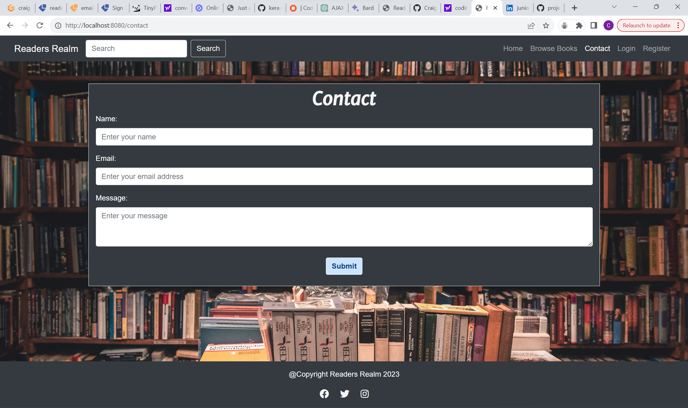
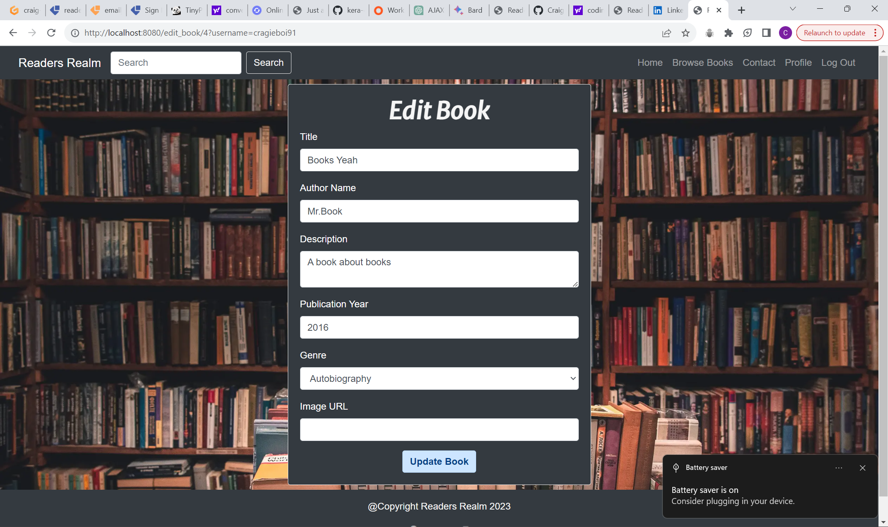

# Readers Realm

------------
[Link to live site here](https://readers-realm-40212841c1a0.herokuapp.com/  "Link to live site here")

<!--  -->

## Table of Contents

- [Readers Realm](#readers-realm)
  - [Table of Contents](#table-of-contents)
  - [Introduction](#introduction)
  - [User Experience (UX)](#user-experience-ux)
    - [User Stories (US)](#user-stories-us)
    - [Design](#design)
    - [Accessability](#accessability)
    - [Database schema](#database-schema)
      - [Database](#database)
      - [Users](#users)
      - [Authors](#authors)
      - [Books](#books)
      - [Reviews](#reviews)
      - [Genres](#genres)
      - [Final data schema](#final-data-schema)
    - [CRUD](#crud)
      - [Step 1 Create](#step-1-create)
      - [Step 2 Read](#step-2-read)
      - [Step 3 Update](#step-3-update)
      - [Step 4 Delete](#step-4-delete)
  - [Features](#features)
  - [Technologies Used](#technologies-used)
    - [Languages Used](#languages-used)
    - [Frameworks, Libraries \& Programs Used](#frameworks-libraries--programs-used)
  - [Testing](#testing)
    - [Bugs](#bugs)
  - [Deployment \& Local Development](#deployment--local-development)
    - [Deployment](#deployment)
    - [Local Development](#local-development)
      - [How to Fork](#how-to-fork)
      - [How to Clone](#how-to-clone)
  - [Credits](#credits)
    - [Images used](#images-used)
    - [Code Used](#code-used)
    - [Content](#content)
    - [media](#media)
    - [Acknowledgments](#acknowledgments)

## Introduction

I have created a simple online book review web app, it will allow users to be able to register to the website, so they can utilize everything the website has to offer. Users that are'nt registered will still be able to view all the books on show, and be able to view reviews that may have been left by other users.
If a user want's to be able to add a book to display on the website they must be registered and logged in, and if users want to leave reviews on any books on the website, they must also be registered and logged in. Registered users will also have their own profile page, which will allow them to view all the reviews and books they have added, users will also be able to edit and delete the reviews and books they've added.

## User Experience (UX)

### User Stories (US)

- **First time visitor goals**
    1. As a first time visitor I want to be able to easily browse book reviews.
    2. As a first time visitor I want to be able to navigate around the website with ease.
    3. As a first time visitor I want a website to visually attractive and provide good user experience
    4. As a first time visitor I want to be able to create an account.

  - **Returning Visitor goals**
    1. As a returning Visitor I want to be able to add/edit/delete reviews of other users books
    2. As a returning Visitor I want to be able to add a book not currently on the website.
    3. As a returning Visitor I want to be able to search for books with ease.
    4. As a returning visitor I don't want other users to be able to edit/delete my reviews or books I've added.

  - **Frequent visitor goals**
  - 1. As a frequent visitor I want to be able to easily access all books I've added onto the site, and make changes and or delete them where appropriate.
  - 2. As a frequent visitor I want to be able to easily access all reviews I've added onto the site, and make changes and or delete them where appropriate.

### Design


- **typography**
- font-family: merriweather sans will be used for all headings spanning across all pages I have opted to use italic also., and then font-family: sans-serif will be used for navigation links, and all page text.

- **Structure**
  <!-- - Users logged out / Not registered -->

  - The structure of the website is as follows, users will first be taken to the Home page, where there are two featured books, which are displayed depending on which two books have the highest overall ratings.
  - Then there's the browse books page where users will be able to view all the books readers realm has to offer.
  - Then we have a reviews page where users will be able to view all the reviews of each individual book.
  - Then we have a contact page.
  - Then we have a login page.
  - Then we have a Register page
  
  <!-- - Users logged in -->

  - Once users are logged in the navigation links at the top will slightly change, login will be replaced with profile, and register is replaced with logout.
  - The profile page consists of the users details, and all the books and reviews they've added.
  - Add book page, to allow users to add books to the website.
  - Edit book page, to allow users to edit any book's they've added.
  - Add review page to allow users to add reviews to any individual book.
  - Edit review page, to allow users to edit any reviews they've added.

- **Imagery**

I have only really used one image, in this app which is used for the background image, throughout the website, the only other images, used will be images of book covers that can be added by users.
  
- **Wireframes**

 [View wire frames here](./assets/images/wireframe-images/)

### Accessability

I have been attentive to make the website as accessible-friendly as possible through the following measures:

- Utilizing semantic HTML to provide meaningful structure and enhance accessibility.
- Incorporating descriptive alt attributes for images on the site to provide alternative text for screen readers.
- I also tested my website using wave which reports back to me any errors/contrast errors that may occur.
  
By implementing the few points above I have made my webpage as accessible and user friendly as possible taking into account those who may be visually impaired and require screen readers for assistance.


### Database schema

[Database schema](documentation/readme/database-schema.png)

For my database schema I have created six tables, Users, Authors, Books, Genres, Book genres and Reviews.

#### Database

For this project I decided to use the relational database PostgreSQL, as I felt that with users being able to add book onto the app, that relationships between the users and the books added would be needed, along with reviews for each book also being associated with that certain book.

#### Users

This table was created for the purpose of creating a system for user to be able to register, storing their email, username and passwords into the database.

#### Authors 

This table was created for the purpose of associating the authors with their book, which helps with the search function I have implemented into the app.

#### Books

This table was created for the purpose of users being able to add their own books onto the readers realm app, It will store the title of the book, the author, a description of what the books about, and the publication year, along with an image url, which is not required as a default image is provided.

#### Reviews

This table was created for the purpose of associating reviews with the books, and the users who have made the reviews.

#### Genres

This table was created for the purpose of users being able to search for genres within the search bar, to view all books of a certain genre.

#### Final data schema

[Final database schema](./documentation/readme/final-database-schema.png)

- I have made a few changed in my database schema throughout developing this app, which included add the image url to the database.

### CRUD

#### Step 1 Create

- All the models were created in my models.py file, and then within my routes.py file, by retrieving the form data, making defensive checks, and then adding and committing them to the database.

#### Step 2 Read

- This was achieved by - When users add a book onto the website, All the information of the book will be displayed on the browse books page, it will also be stored on the users profile.
- Reviews, when users add a review to a book it will be displayed under that books review page, and it will also be viewed on the users profile.

#### Step 3 Update

- Users can update their reviews and they can update the information on the book from their profile page with clear buttons easily visible for users to see that they can edit their reviews and book.

#### Step 4 Delete

_ Users can delete all their reviews and books from their profile page, both reviews and books added have a delete button, but firstly user will be prompted with modal if they are sure they'd like to delete their review or book. If users decide to delete, a review or book, It will be deleted from the whole website.

## Features

<details>

  <summary>Home Page</summary>

  

</details>

<details>

  <summary>Browse Books Page</summary>

  

</details>

<details>

  <summary>Contact Page</summary>

  
  
</details>

<details>

  <summary>Register page</summary>

  

</details>

<details>

  <summary>Login Page</summary>

  

</details>

<details>

  <summary>Edit Book page</summary>

  

</details>

<details>

  <summary>Edit Review Page</summary>


</details>

<details>

  <summary>Add Book Page</summary>

  

</details>

<details>

  <summary>Search Results Page</summary>

  

</details>

<details>

  <summary>Add Review Page</summary>

  

</details>


## Technologies Used

### Languages Used

HTML, CSS, JavaScript and Python have been used for this project.

### Frameworks, Libraries & Programs Used

Git - For version control.
Bootstrap v4.6.0 - For responsiveness and page layouts
Flask
Jinja2
postgreSQL
sqlalchemy
​

[Github](https://github.com/Craig-Hudson) - To save and store the files for the website.

​
[Google Fonts](https://fonts.google.com/) - To import the fonts used on the website.

​
[Font Awesome](https://fontawesome.com/) - For the iconography on the website.

​Chrome Dev Tools - To troubleshoot and test features, solve issues with responsiveness and styling.

[Convert png to webp](https://www.freeconvert.com/) - I converted my images to webp using this site.

[tiny.png](https://tinypng.com/) - To reduce the file size of my images for better website performance

[Image resizer](https://www.resizepixel.com/) - To reduce any unnecessary height and width on photos, also minimizing file size.

Balsamiq - I used Balsamiq wireframes from a desktop app for my wireframes,

[W3School](https://www.w3schools.com/) To refer to anything Java script related that i may have been unsure of.

Gitpod - I have used vscode as my ide

## Testing

All my testing can be found in the [testing file](testing.md)

### Bugs

- **Solved Bugs**
- Navigation links between 768px and 940px were being squished as I had the burger icon
  only displayed up until , so I managed to adjust the necessary bootstrap class navbar-expand to ensure the navigation links were being responsive and weren't still squished.

- When the users enter the form to add books into the database that all worked ok with pulling out image urls and putting them
onto the browse-books.html page, but the issue I had was with storing a default image, if the user choice weather or not to
enter an image of the book,

- On mobile screens the register form was being pushed up into the navbar, I noticed using devtools
that my media query at 576px of making the height of the container 60vh and the height of 100% at 320px seemed to be causing the issue, so I tested it on the live site without it, and this had resolved the issue.

- While testing my register page, I came across and bug where it wouldn't let me register at all, and I kept getting the same warning on the page, suggesting that I had'nt entered a password with 8 characters, a number, and a special character, so which led me to believe it was something wrong with the password pattern in my route.py file that may be causing the issue, and after a quick search and a change of pattern, it then began to let me log in, and my register_post function in my route file, executed as expected.

- **Known Bugs**

Currently There is no known bugs

## Deployment & Local Development

### Deployment

Old Heroku Deployment Instructions
The site is deployed using Heroku. To deploy to Heroku:

1. To successfully deploy on Heroku we first need to create some files: a requirements.txt file and a Procfile.

2. The requirements.txt file contains all the applications and dependencies that are required to run the app. To create the requirements.txt file run the following command in the terminal:

    ```bash
    pip3 freeze --local > requirements.txt
    ```

3. The Procfile tells Heroku which files run the app and how to run it. To create the Procfile run the following command in the terminal:

    ```bash
    echo web: python app.py > Procfile
    ```

    NOTE: The Procfile uses a capital P and doesn't have a file extension on the end.

4. If the Procfile has been created correctly it will have the Heroku logo next to it. It is also important to check the Procfile contents, as sometimes on creation a blank line will be added at the end of the file. This can sometimes cause problems when deploying to Heroku, so if the file contains a blank line at the end, delete this and save the file. Make sure to save both these files and then add, commit and push them to GitHub.

5. Login (or sign up) to [Heroku.com](https://www.heroku.com).

6. Click the new button and then click create new app.

7. You will then be asked to give your app a name (these must be unique so you cannot reuse bookworm) and select a region. Once these are completed click create app.

8. You will now need to connect the Heroku app to the GitHub repository for the site. Select GitHub in the deployment section, find the correct repository for the project and then click connect.

9. Once the repository is connected, you will need to provide Heroku some config variables it needs to build the app. Click on the settings tab and then click reveal config vars button. You will now need to add the environment key/value variables that were used in the env.py file:

    | KEY | VALUE |
    | :-- | :-- |
    | IP | 0.0.0.0 |
    | PORT | 5000 |
    | SECRET_KEY | ANY_SECRET_KEY* |
    | DB_URL | postgresql:///readersrealm |
    | DEBUG | TRUE** |

    *Denotes a value that is specific to your app.

    **This is set to true to enable us to see any bugs on the live site. ~~Please change to FALSE after deployment.~~

10. You're now ready to click the enable automatic deploys and create button. Heroku will start building the app.

11. As this project utilizes a relational database, there are a few more steps to set this up.

12. On the heroku dashboard go to resources tab and then select add-ons. You will need to search for and select heroku postgres. For this project the hobby dev free tier is fine.

13. Go back into settings and reveal config vars. You should now see a new key called DATABASE_UL and the value should have been pre-populated.

14. We will now need to go the more button on the dashboard and select run console. This is where we will set up the tables in the database we have just created.

15. Type python3 and then once the python interpreter opens, we can run the following:

    ```bash
    from readersrealm import db
    db.create_all()
    exit()
    ```

16. Now that the relational database has been set up and the tables created, we can now click open app and the Readers realm application should now open in a new tab.

### Local Development

#### How to Fork

To fork the repository:

1. Log in (or sign up) to Github.

2. Go to the repository for this project, [ReadersRealm](https://github.com/Craig-Hudson/online-book-review).

3. Click the Fork button in the top right corner.

#### How to Clone

To clone the repository:

1. Log in (or sign up) to GitHub.

2. Go to the repository for this project, [ReadersRealm](https://github.com/Craig-Hudson/online-book-review).

3. Click on the code button, select whether you would like to clone with HTTPS, SSH or GitHub CLI and copy the link shown.

4. Open the terminal in your code editor and change the current working directory to the location you want to use for the cloned directory.

5. Type the following command in the terminal (after the git clone you will need to paste the link you copied in step 3 above):

    ```bash
    git clone { & THE LINK FROM STEP 3 }
    ```

6. Set up a virtual environment (this step is not required if you are using the Code Institute Template in GitPod as this will already be set up for you).

7. Install the packages from the requirements.txt file by running the following command in the Terminal:

    ```bash
    pip3 install -r requirements.txt
    ```

- - -
​

## Credits

### Images used

-Image by <https://www.freepik.com/free-vector/gradient-no-photo-sign-design_22890125.htm#query=unavailable%20image&position=1&from_view=search&track=ais>
This image is used as a default image for users who don't enter a URL link in the add book form.

### Code Used

- Most of the code in this project was written my myself, references to w3schools and mdn web docs have been made with some of the code also, weather thats remembering a syntax, or re jogging my memory.

### Content

The use of w3schools/MDN web docs and code institute lessons for any prompts and reminders for any template syntax or how to create the database models.

The other content for this project was written by Craig Hudson.

### media

- All Images for the site were all taken from [vecteezy](https://www.vecteezy.com/)

### Acknowledgments

I would like to acknowledge the following people who helped me along the way in completing this project:

- My code institute mentor Brian for feedback and the many ways I can improve.
- My partner for having the patience with me and allowing me more time to work on projects.
- My fellow classmates Ross and dan for any hints and tips that they have given me over the last few weeks.
- Other family who have helped test my online book review and have given me constructive feedback, and ideas that I would be able to improve my application.
