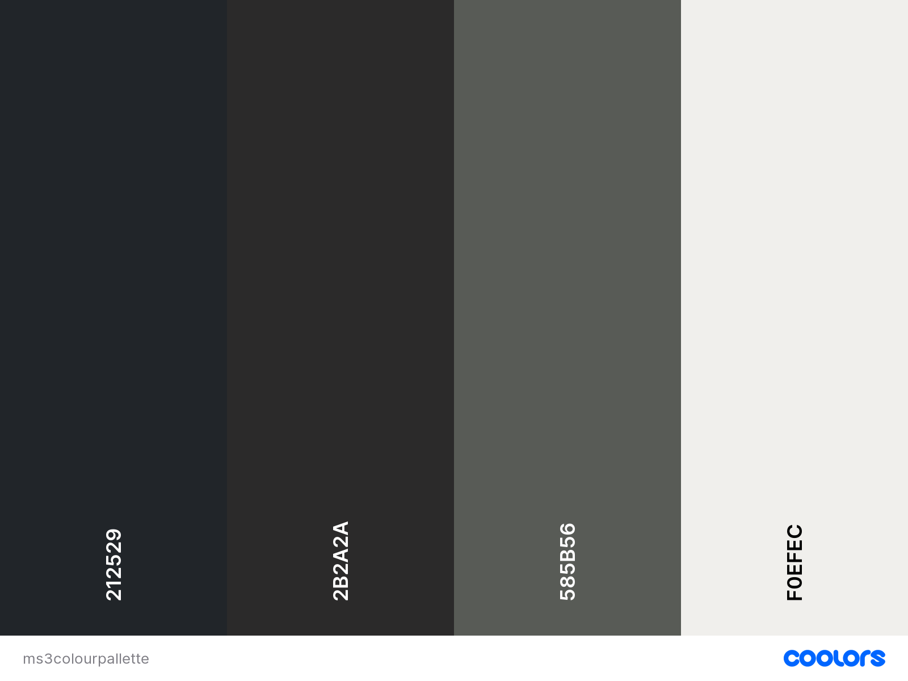

# Readers Realm

------------
[Link to live site here](#  "Link to live site here")

<!--  -->

## Table of Contents

- [Readers Realm](#readers-realm)
  - [Table of Contents](#table-of-contents)
  - [Introduction](#introduction)
  - [User Experience (UX)](#user-experience-ux)
    - [User Stories (US)](#user-stories-us)
    - [Design](#design)
    - [Accessability](#accessability)
  - [Features](#features)
  - [Technologies Used](#technologies-used)
    - [Languages Used](#languages-used)
    - [Frameworks, Libraries \& Programs Used](#frameworks-libraries--programs-used)
  - [Testing](#testing)
    - [Bugs](#bugs)
  - [Deployment \& Local Development](#deployment--local-development)
    - [Deployment](#deployment)
    - [Local Development](#local-development)
      - [How to Fork](#how-to-fork)
      - [How to Clone](#how-to-clone)
  - [Credits](#credits)
    - [Images used](#images-used)
    - [Code Used](#code-used)
    - [Content](#content)
    - [media](#media)
    - [Acknowledgments](#acknowledgments)

## Introduction

## User Experience (UX)

### User Stories (US)

- **First time visitor goals**
    1. As a first time visitor I want to be able to easily browse book reviews.
    2. As a first time visitor I want to be able to navigate around the website with ease.
    3. As a first time visitor I want a website to visually attractive and provide good user experience
    4. As a first time visitor I want to be able to create an account.

  - **Returning Visitor goals**
    1. As a returning Visitor I want to be able to add/edit/delete reviews of other users books
    2. As a returning Visitor I want to be able to add a book not currently on the website.
    3. As a returning Visitor I want to be able to search for books with ease.
    4. As a returning visitor I don't want other users to be able to edit/delete my reviews or books I've added.

  - **Frequent visitor goals**
  - 1. As a frequent visitor I want to be able to easily access all books I've added onto the site, and make changes and or delete them where appropriate.
  - 2. As a frequent visitor I want to be able to easily access all reviews I've added onto the site, and make changes and or delete them where appropriate.

### Design

- 
  
  - **typography**
  - font-family: merriweather sans will be used for all headings spanning across all pages I have opted to use italic also., and then font-family: sans-serif will be used for navigation links, and all page text.

  - **Structure**
    - 

  - **Imagery**
  - 

  - **Wireframes**

 [View wire frames here](./assets/images/wireframe-images/)

### Accessability

I have been attentive to make the website as accessible-friendly as possible through the following measures:

- Utilizing semantic HTML to provide meaningful structure and enhance accessibility.
- Incorporating descriptive alt attributes for images on the site to provide alternative text for screen readers.
- I also tested my website using wave which reports back to me any errors/contrast errors that may occur.
  
By implementing them few points above I have made my webpage as accessible and user friendly as possible taking into account those who may be visually impaired and require screen readers for assistance.

## Features

- 

## Technologies Used

### Languages Used

HTML, CSS, JavaScript and Python have been used for this project.

### Frameworks, Libraries & Programs Used

Git - For version control.
Bootstrap v4.6.0 - For responsiveness and page layouts
Flask
Jinja2
postgreSQL
sqlalchemy
​

[Github](https://github.com/Craig-Hudson) - To save and store the files for the website.

​
[Google Fonts](https://fonts.google.com/) - To import the fonts used on the website.

​
[Font Awesome](https://fontawesome.com/) - For the iconography on the website.

​Chrome Dev Tools - To troubleshoot and test features, solve issues with responsiveness and styling.

[Convert png to webp](https://www.freeconvert.com/) - I converted my images to webp using this site.

[tiny.png](https://tinypng.com/) - To reduce the file size of my images for better website performance

[Image resizer](https://www.resizepixel.com/) - To reduce any unnecessary height and width on photos, also minimizing file size.

Balsamiq - I used Balsamiq wireframes from a desktop app for my wireframes,

[W3School](https://www.w3schools.com/) To refer to anything Java script related that i may have been unsure of.

VsCode - I have used vscode as my ide

## Testing

All my testing can be found in the [testing file](testing.md)

### Bugs

- **Solved Bugs**
- Navigation links between 768px and 940px were being squished as I had the burger icon
  only displayed up until , so I managed to adjust the necessary bootstrap class navbar-expand to ensure the navigation links were being responsive and weren't still squished.

- When the users enter the form to add books into the database that all worked ok with pulling out image urls and putting them
onto the browse-books.html page, but the issue I had was with storing a default image, if the user choice weather or not to
enter an image of the book,

- **Known Bugs**

Currently There is no known bugs

## Deployment & Local Development

### Deployment

Github Pages was used to deploy the live website. The instructions to achieve this are below:
​

1. Log in (or sign up) to Github.
2. Find the repository for this project here > [Millionaire](<https://github.com/Craig-Hudson/Millionaire>)
3. Click on the Settings link.
4. Click on the Pages link in the left hand side navigation bar.
5. In the Source section, choose main from the drop down select branch menu. Select Root from the drop down select folder menu.
6. Click Save. Your live Github Pages site is now deployed at the URL shown.
​

### Local Development

#### How to Fork

​
To fork The Millionaire repository:
​

1. Log in (or sign up) to Github.
2. Go to the repository for this project, Millionaire !(<https://github.com/Craig-Hudson/Millionaire.git>)
3. Click the Fork button in the top right corner.
​

#### How to Clone

​
To clone The Millionaire repository:
​

1. Log in (or sign up) to GitHub.
2. Go to the repository for this project.
3. Click on the code button, select whether you would like to clone with HTTPS !(<https://github.com/Craig-Hudson/Millionaire.git>) and copy the link shown.
4. Open the terminal in your code editor and change the current working directory to the location you want to use for the cloned directory.
5. Type 'git clone' into the terminal and then paste the link you copied in step 3. Press enter.
​

## Credits

### Images used

- Image by "https://www.freepik.com/free-vector/bike-guy-wattpad-book-cover_28596242.htm#query=book%20covers&position=4&from_view=keyword&track=ais"
- Image by "https://www.freepik.com/free-vector/minimalist-book-cover-template_13209950.htm#query=book%20covers&position=10&from_view=keyword&track=ais"
-Image by https://www.freepik.com/free-vector/gradient-no-photo-sign-design_22890125.htm#query=unavailable%20image&position=1&from_view=search&track=ais

### Code Used

- Most of the code in this project was written my myself, references to w3schools and mdn web docs have been made with some of the code also, weather thats remembering a syntax, or re jogging my memory.

### Content

The use of the information which I used for the sanitizeAnswer function which I used some of the code from an stack overflow post and the high score local storage functions in the game.js and home.js files which I used a youtube tutorial for.
The use of w3schools for any prompts for any syntax I may of needed a reminder off.

The other content for this project was written by Craig Hudson.

### media

- All Images for the site were all taken from [vecteezy](https://www.vecteezy.com/)

### Acknowledgments

I would like to acknowledge the following people who helped me along the way in completing this project:

- My code institute mentor Narender Singh for feedback and the many ways I can improve.
- My partner for having the patience with me and allowing me more time to work on projects.
- My fellow classmates Ross and dan for any hints and tips that they have given me over the last few weeks.
- Other family who have helped test my quiz application and given me constructive feedback, and ideas that I would be able to improve the quiz application.