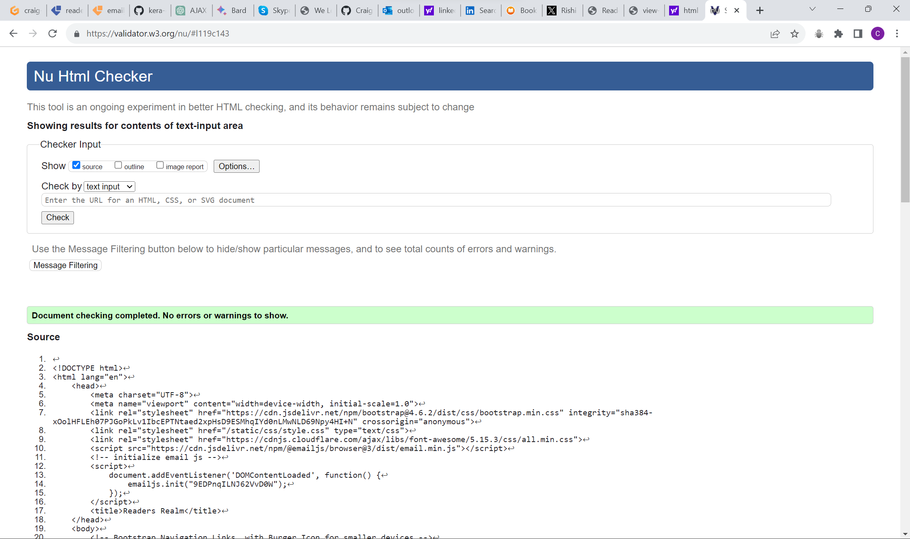
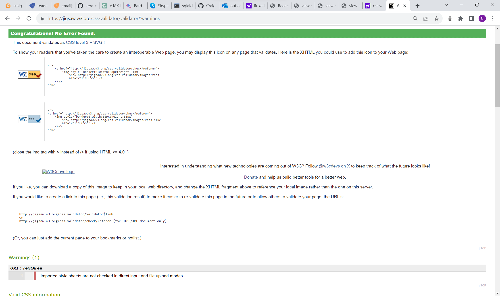
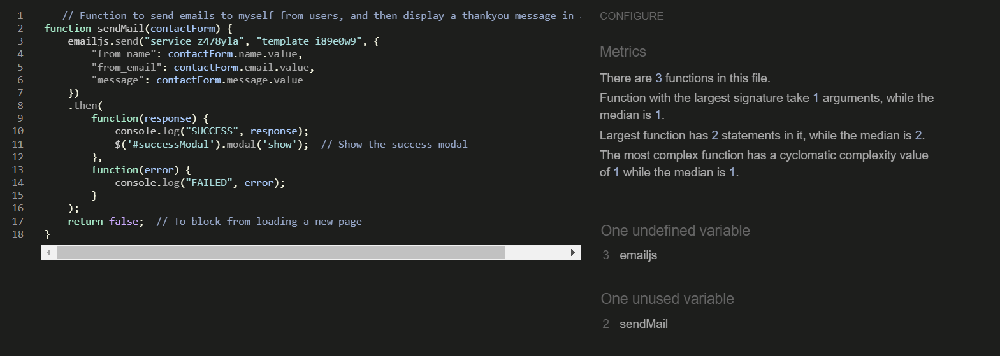
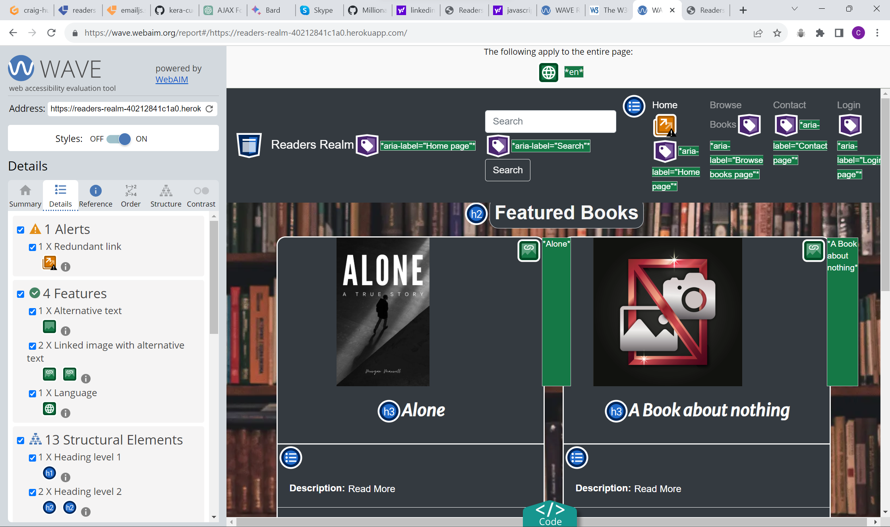
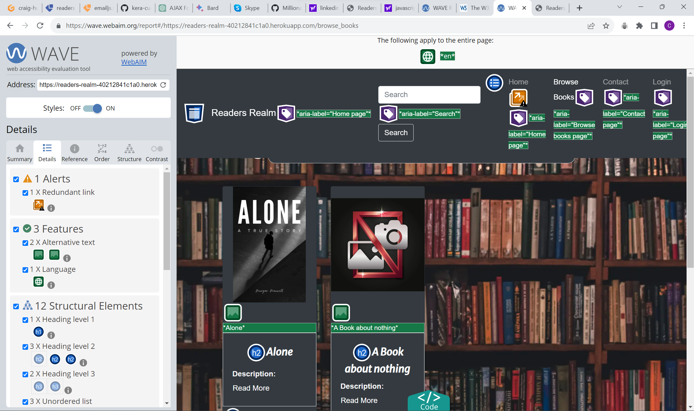
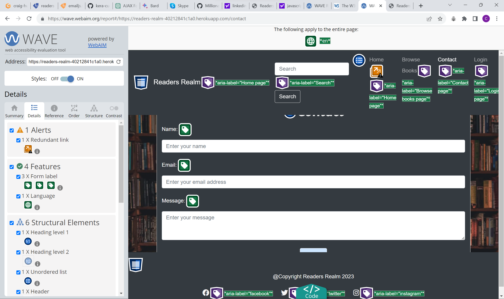
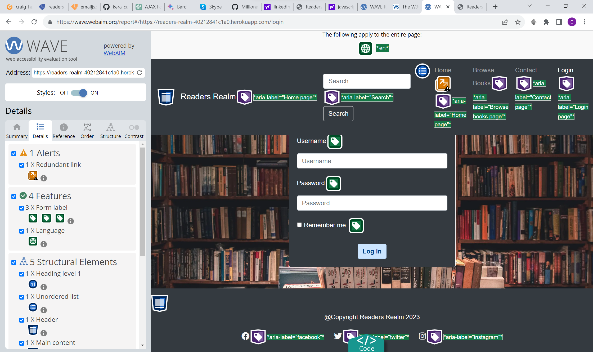
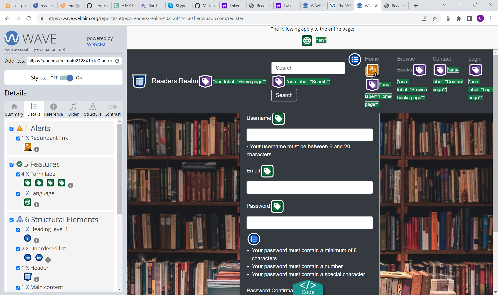

# Readers Realm Testing

## Table of contents

- [Readers Realm Testing](#readers-realm-testing)
  - [Table of contents](#table-of-contents)
  - [Overview](#overview)
  - [Automated Testing](#automated-testing)
    - [Lighthouse](#lighthouse)
    - [HTML validator](#html-validator)
    - [CSS validator](#css-validator)
    - [JavaScript Validator](#javascript-validator)
  - [wave reports](#wave-reports)
  - [Manual Testing](#manual-testing)
    - [Testing user Stories](#testing-user-stories)
    - [Full Testing](#full-testing)

## Overview

I used test driven development throughout the entire build for this project.
This includes using chrome developer tools to test for responsiveness and for general positioning of elements, I also used the dev tools and the terminal with the use of print statements in my python to help identify if there was any errors in the console and where the issues may of been arising from.

## Automated Testing

### Lighthouse

- Desktop Lighthouse report perfect scores all round!

- Mobile lighthouse report 

### HTML validator

I have used the html validator [W3C HTML Validator](https://validator.w3.org/)
Initially many of my html files had either info's or warnings, which have all been corrected,
A couple of my html files had errors which have now also been fixed and are all clear of errors.

### CSS validator

- My css has come back with no errors and no warnings.

### JavaScript Validator

- Home page JavaScript validation on JShint

- As you can see if the above image it's coming back with two info's

- First one is about emailJS not being defined, I followed along the code institute tutorial for
  setting up emailJS and emailJS is initialized in my base.html file starting on line 11.
  
- Second is the function sendMail being unused, but this is called on line 7 in my contact.html page

## wave reports

- Home Page

- Browse Books Page

- Contact page

- Login page

- Register page

- Review Page
  

- The pages above wave reports have zero errors and zero contrast errors, a few of them have alerts for possible headings and redundant link.

- The following pages below I was unable to get to use the wave report due to them being restricted pages
only for users who are logged in, but I have made sure anything that may be a contrast error has been
resolved, and making sure all the headings are there, and none are skipped.

- Add Book Page

- Edit Book page

- Add Review page

- Edit Review page

- Profile page

## Manual Testing

### Testing user Stories

- **First time Visitors**

|  Goals | How are they achieved?  |
| ------------ | ------------ |
| As a first time visitor I want to be able to easily browse book reviews. |  |
| As a first time visitor I want to be able to navigate around the website with ease. |  |
| As a first time visitor I want a website to visually attractive and provide good user experience |  |
| As a first time visitor I want to be able to create an account.  |  |

- **Returning Visitor Goals**

| Goals  |  How are they achieved? |
| ------------ | ------------ |
| As a returning Visitor I want to be able to add/edit/delete reviews of other users books |  |
| As a returning Visitor I want to be able to add a book not currently on the website. |  |
| As a returning Visitor I want to be able to search for books with ease. |  |
| As a returning visitor I don't want other users to be able to edit/delete my reviews or books I've added. |  |
​

- **Frequent visitor goals**

|  Goals | How are they achieved  |
| ------------ | ------------ |
| As a frequent visitor I want to be able to easily access all books I've added onto the site, and make changes and or delete them where appropriate. |  |
| As a frequent visitor I want to be able to easily access all reviews I've added onto the site, and make changes and or delete them where appropriate.
 |  |

### Full Testing

Testing was done on the following devices and browsers

- Devices
  - Lenovo Laptop 14inch screen
  - oppo xp lite (android)

- Browsers
  - Google chrome
  - Firefox

-**Index Page**

| Feature  | Expected outcome  | Testing performed  | Result  | Pass/Fail  |
| ------------ | ------------ | ------------ | ------------ | ------------ |
| Browse Books Link | To take me to the Browse books page | Click link | I Taken to browse book page | Pass |
| Contact page Link | To take me to the contact page | Click Link | I was taken to the contact page | Pass |
| Login link(only visible if user isn't logged in) | To take me to the login page | Click link | I was taken to the login page. | Pass |
| Register link (Only visible when users aren't logged in) | To take me to the register page | Click link | I was taken to the register page. | Pass |
| Profile page(Only visible to user who are logged in) | To be taken to the profile page | Click link | I was taken to the profile page. | Pass |
| Logout link | Once user clicks logout the navigation links should switch back to login and profile. |  |  |  |
| Readers realm next to search bar | This is clickable, and should always return me to the home page | Click readers realm | I was taken to the home page. | Pass |
| Burger Icon (Mobile and tablet only) | Once clicked it should drop down the search bar and navigation links | Click burger icon | Once clicked it dropped down the search bar and navigation links | Pass |
| Feature book images | The feature book images are clickable and should take user to the review for that book | Click Image | Once I clicked the image, I was taken to the review page for that specific book. | Pass |
| Search button | Once clicked it should take me to a search results page | Click search button | I was taken to the search results page |  |
| Footer Links | All three social icon links should open a new tab and direct the user to the intended website | Click the three links | All three links opened in new tabs, and directed user to the intended website | Pass |
| Read more pop up modal | When user clicks read more next to the description a pop up modal with the description should pop up | Click read more| Once I clicked on read more a pop up modal displayed | Pass |
| read more pop up modal(close button) | When user clicks on the close button the modal should hide, and the user should be kept on the same page | Click close button | Once I clicked on the close button the modal hid, and I was kept on the same page  | Pass  |

**Please note the navigation links, search bar and the footer links all extend from my base.html and therefore work on every page on the website.**

- **Contact Page**

| Feature  | Expected outcome  | Testing performed  | Result  | Pass/Fail  |
| ------------ | ------------ | ------------ | ------------ | ------------ |
| The three input fields | If left blank all three should prompt the user to fill in the field | Fill in two different fields and leave one blank to ensure all three prompt the user | All three input fields if left blank, prompted the user to fill in the field | Pass |
| When the user clicks submit a modal should pop up with a thank you message | Modal to pop up with a thank you message | Click submit button | Once I clicked the submit button the modal appeared | Pass |
| Return home button on modal | To return user to the home page | Click return home button | Once I clicked the return home button I was directed to the home page | Pass |
| Closing the modal with the x or clicking on the page, away from the modal | Modal should close | Click on the x and click on the page | Modal closed | Pass |

- **Browse Book page**

| Feature  | Expected outcome  | Testing performed  | Result  | Pass/Fail  |
| ------------ | ------------ | ------------ | ------------ | ------------ |
| Add Book button(Not logged in) | Pop up modal to display to inform user that they need to be logged in to add a book  | Click button | Once the button was clicked, the modal popped up. | Pass |
| Add book button(Logged in) | Once the button has been clicked the user should be taken to the add book page | Click button | I was taken to the add book page. | Pass |
| Pop up modal(User not logged in) close button | Once the close button has been clicked the modal should close, and the user should be kept on the same page | Click close button | The modal closed, and I was kept on the same page | Pass |
| Pop up modal(User not logged in) Login button | Once the login button has been clicked the user should be directed to the login page. | Click login button | I was taken to the login page | Pass |
| Read more pop up modal | When user clicks read more next to the description a pop up modal with the description should pop up | Click read more| Once I clicked on read more a pop up modal displayed | Pass |
| read more pop up modal(close button) | When user clicks on the close button the modal should hide, and the user should be kept on the same page | Click close button | Once I clicked on the close button the modal hid, and I was kept on the same page  | Pass  |

- **Login Page**
  
| Feature  | Expected outcome  | Testing performed  | Result  | Pass/Fail  |
| ------------ | ------------ | ------------ | ------------ | ------------ |
| Input fields | Prompt user to fill in if they have left any input field out | Leave one blank, and fill the other input field in to determine if a prompt appears | I was prompted to fill in both input fields | Pass  |
| Login button | To take user to the home page | Click button | I was taken to the home page | Pass |

- **Register Page**
  
| Feature  | Expected outcome  | Testing performed  | Result  | Pass/Fail  |
| ------------ | ------------ | ------------ | ------------ | ------------ |
| Input fields | prompt user to input if left empty | Fill in all but one input field | I was prompted to fill in the all input fields that were left blank | Pass |
| Username input field | If the user enters a username that is less then 6 characters they will be prompted to enter a minimum of 6 characters, It will also only let the user enter a max of 20 characters | Enter less then 6 characters, and try to enter more than 20 characters. | I was prompted to enter more characters when I entered 4 characters, and It wouldn't allow me to enter more than 20 characters | Pass |
| Flash message if a username is already taken | When clicking submit, If a user has already entered a username that already exists a flash message should appear. | Enter username already taken  | Flash message appeared informing user that, the username they have chosen is already in use | Pass |
| Flash message if email is already in use | When clicking submit, If a user has already entered a email address that already exists, a flash message should appear. | Flash message to appear if an email address is already in use | Enter an email address that's already taken | Flash message appeared informing user that the email address is already in use. | Pass |
| Flash message if password, and password confirmation don't match | Flash message to appear if a user enters a different password and password confirmation.  | Enter different passwords | FLash message appeared informing user that their passwords did'nt match | Pass |
| Register Button | When user clicks submit, they should be directed to the login page, which will have a flash message appear informing them that their registration was successful.  | Fill out form, and click submit | I was directed to the login page, and the flash message appeared | Pass |

- **Error Page**
  
| Feature  | Expected outcome  | Testing performed  | Result  | Pass/Fail  |
| ------------ | ------------ | ------------ | ------------ | ------------ |
|  |  |  |  |  |

- **Add Book Page**
  
| Feature  | Expected outcome  | Testing performed  | Result  | Pass/Fail  |
| ------------ | ------------ | ------------ | ------------ | ------------ |
|  |  |  |  |  |

- **Edit Book Page**
  
| Feature  | Expected outcome  | Testing performed  | Result  | Pass/Fail  |
| ------------ | ------------ | ------------ | ------------ | ------------ |
|  |  |  |  |  |

- **Add Review Page**
  
| Feature  | Expected outcome  | Testing performed  | Result  | Pass/Fail  |
| ------------ | ------------ | ------------ | ------------ | ------------ |
|  |  |  |  |  |

- **Edit Review Page**
  
| Feature  | Expected outcome  | Testing performed  | Result  | Pass/Fail  |
| ------------ | ------------ | ------------ | ------------ | ------------ |
|  |  |  |  |  |

- **Review Page**
  
| Feature  | Expected outcome  | Testing performed  | Result  | Pass/Fail  |
| ------------ | ------------ | ------------ | ------------ | ------------ |
|  |  |  |  |  |

- **Profile Page**
  
| Feature  | Expected outcome  | Testing performed  | Result  | Pass/Fail  |
| ------------ | ------------ | ------------ | ------------ | ------------ |
|  |  |  |  |  |