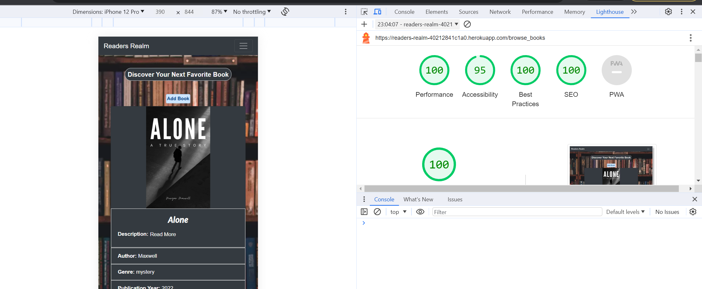
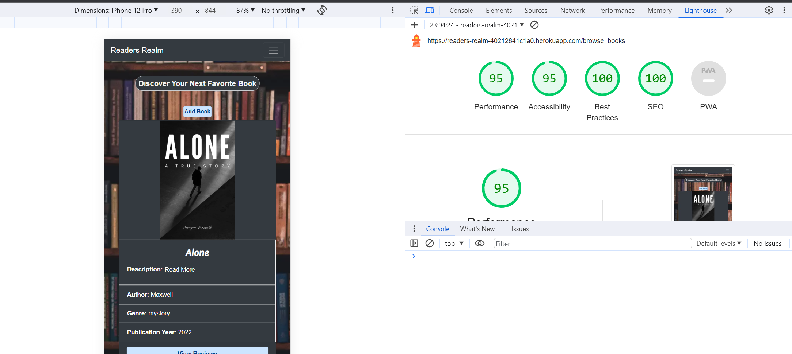
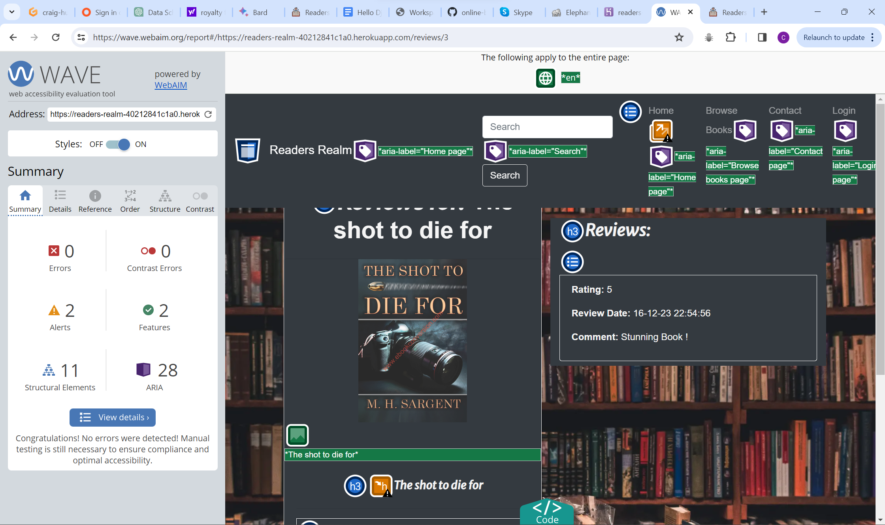
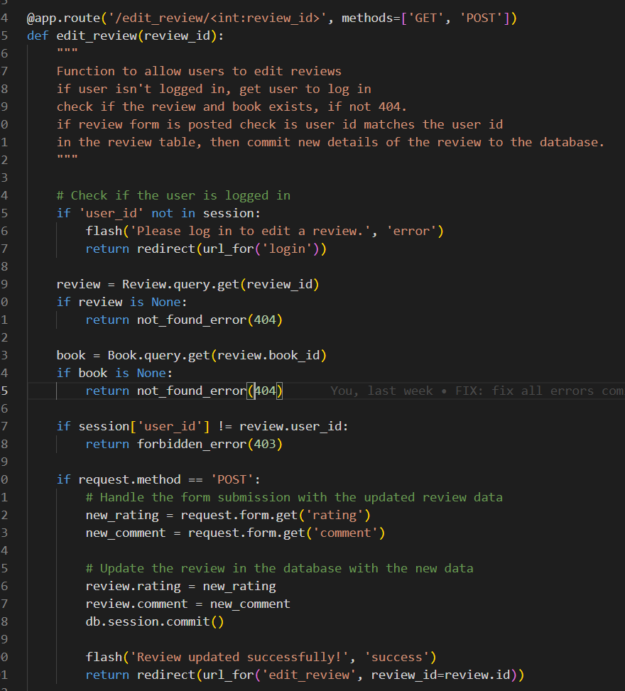

# Readers Realm Testing

## Table of contents

- [Readers Realm Testing](#readers-realm-testing)
  - [Table of contents](#table-of-contents)
  - [Overview](#overview)
  - [Automated Testing](#automated-testing)
    - [Lighthouse](#lighthouse)
    - [HTML validator](#html-validator)
    - [CSS validator](#css-validator)
    - [JavaScript Validator](#javascript-validator)
  - [wave reports](#wave-reports)
  - [Manual Testing](#manual-testing)
    - [Testing user Stories](#testing-user-stories)
    - [Full Testing](#full-testing)

## Overview

I used test driven development throughout the entire build for this project.
This includes using chrome developer tools to test for responsiveness and for general positioning of elements, I also used the dev tools and the terminal with the use of print statements in my python to help identify if there was any errors in the console and where the issues may of been arising from.

## Automated Testing

### Lighthouse

- Desktop Lighthouse report perfect scores all round!

- Mobile lighthouse report 

### HTML validator

I have used the html validator [W3C HTML Validator](https://validator.w3.org/)
Initially many of my html files had either info's or warnings, which have all been corrected,
A couple of my html files had errors which have now also been fixed and are all clear of errors.

### CSS validator

- My css has come back with no errors and no warnings.

### JavaScript Validator

- Home page JavaScript validation on JShint

- As you can see if the above image it's coming back with two info's

- First one is about emailJS not being defined, I followed along the code institute tutorial for
  setting up emailJS and emailJS is initialized in my base.html file starting on line 11.
  
- Second is the function sendMail being unused, but this is called on line 7 in my contact.html page

## wave reports

- Home Page

- Browse Books Page

- Contact page

- Login page

- Register page

- Review Page
  

- The pages above wave reports have zero errors and zero contrast errors, a few of them have alerts for possible headings and redundant link.

- The following pages below I was unable to get to use the wave report due to them being restricted pages
only for users who are logged in, but I have made sure anything that may be a contrast error has been
resolved, and making sure all the headings are there, and none are skipped.

- Add Book Page

- Edit Book page

- Add Review page

- Edit Review page

- Profile page

## Manual Testing

### Testing user Stories

- **First time Visitors**

|  Goals | How are they achieved?  |
| ------------ | ------------ |
| As a first time visitor I want to be able to easily browse book reviews. | This was achieved by having a view reviews button under each book, easily visible to the user. |
| As a first time visitor I want to be able to navigate around the website with ease. | This was achieved by always having the navigation bar at the top of the screen, allowing for users to easily navigate around the website |
| As a first time visitor I want a website to visually attractive and provide good user experience | This was achieved by using a relatively simple design, with the colors being consistent throughout the whole site, and the use of the background image.  |
| As a first time visitor I want to be able to create an account.  | This was achieved by having the register navigation link always visible at the top of every page. |

- **Returning Visitor Goals**

| Goals  |  How are they achieved? |
| ------------ | ------------ |
| As a returning Visitor I want to be able to add/edit/delete reviews of other users books | This was achieved by creating a user profile page, where the users can see all their reviews, and all the books they have added themselves onto the website, each with their own edit and delete button.  |
| As a returning Visitor I want to be able to add a book not currently on the website. | This was done by comparing book names already stored in the database, along with the author name, and if none of these match whats in the database, then the users will be able to add a book onto the website, if not a flash message will appear on the add book form. |
| As a returning Visitor I want to be able to search for books with ease. | This was achieved by having a search bar in the top left of the screen in my header, which will allow users to search for anything ranging from books, to author names etc.  |
| As a returning visitor I don't want other users to be able to edit/delete my reviews or books I've added. | This was done by always thinking defensively while I was developing the app, always checking if users ore logged in, checking if users ID matches the ID's of the reviews, books etc.  |
​

- **Frequent visitor goals**

|  Goals | How are they achieved  |
| ------------ | ------------ |
| As a frequent visitor I want to be able to easily access all books I've added onto the site, and make changes and or delete them where appropriate. | This was done by having a profile page for every user who registers to readers realm, there are two sections on the profile page, one for reviews and one for book, and each do have their own delete buttons for users to be able to delete books where appropriate. |
| As a frequent visitor I want to be able to easily access all reviews I've added onto the site, and make changes and or delete them where appropriate.
 | This was done by having a profile page for every user who registers to readers realm, there are two sections on the profile page, one for reviews and one for book, and each do have their own delete buttons for users to be able to delete reviews where appropriate. |

### Full Testing

Testing was done on the following devices and browsers

- Devices
  - Lenovo Laptop 14inch screen
  - oppo xp lite (android)

- Browsers
  - Google chrome
  - Firefox

-**Index Page**

| Feature  | Expected outcome  | Testing performed  | Result  | Pass/Fail  |
| ------------ | ------------ | ------------ | ------------ | ------------ |
| Browse Books Link | To take me to the Browse books page | Click link | I Taken to browse book page | Pass |
| Contact page Link | To take me to the contact page | Click Link | I was taken to the contact page | Pass |
| Login link(only visible if user isn't logged in) | To take me to the login page | Click link | I was taken to the login page. | Pass |
| Register link (Only visible when users aren't logged in) | To take me to the register page | Click link | I was taken to the register page. | Pass |
| Profile page(Only visible to user who are logged in) | To be taken to the profile page | Click link | I was taken to the profile page. | Pass |
| Logout link | Once user clicks logout the navigation links should switch back to login and profile. |  |  |  |
| Readers realm next to search bar | This is clickable, and should always return me to the home page | Click readers realm | I was taken to the home page. | Pass |
| Burger Icon (Mobile and tablet only) | Once clicked it should drop down the search bar and navigation links | Click burger icon | Once clicked it dropped down the search bar and navigation links | Pass |
| Feature book images | The feature book images are clickable and should take user to the review for that book | Click Image | Once I clicked the image, I was taken to the review page for that specific book. | Pass |
| Search button | Once clicked it should take me to a search results page | Click search button | I was taken to the search results page |  |
| Footer Links | All three social icon links should open a new tab and direct the user to the intended website | Click the three links | All three links opened in new tabs, and directed user to the intended website | Pass |
| Read more pop up modal | When user clicks read more next to the description a pop up modal with the description should pop up | Click read more| Once I clicked on read more a pop up modal displayed | Pass |
| read more pop up modal(close button) | When user clicks on the close button the modal should hide, and the user should be kept on the same page | Click close button | Once I clicked on the close button the modal hid, and I was kept on the same page  | Pass  |

**Please note the navigation links, search bar and the footer links all extend from my base.html and therefore work on every page on the website.**

- **Contact Page**

| Feature  | Expected outcome  | Testing performed  | Result  | Pass/Fail  |
| ------------ | ------------ | ------------ | ------------ | ------------ |
| The three input fields | If left blank all three should prompt the user to fill in the field | Fill in two different fields and leave one blank to ensure all three prompt the user | All three input fields if left blank, prompted the user to fill in the field | Pass |
| When the user clicks submit a modal should pop up with a thank you message | Modal to pop up with a thank you message | Click submit button | Once I clicked the submit button the modal appeared | Pass |
| Return home button on modal | To return user to the home page | Click return home button | Once I clicked the return home button I was directed to the home page | Pass |
| Closing the modal with the x or clicking on the page, away from the modal | Modal should close | Click on the x and click on the page | Modal closed | Pass |

- **Browse Book page**

| Feature  | Expected outcome  | Testing performed  | Result  | Pass/Fail  |
| ------------ | ------------ | ------------ | ------------ | ------------ |
| Add Book button(Not logged in) | Pop up modal to display to inform user that they need to be logged in to add a book.  | Click button | Once the button was clicked, the modal popped up. | Pass |
| Add book button(Logged in) | Once the button has been clicked the user should be taken to the add book page | Click button | I was taken to the add book page. | Pass |
| Pop up modal(User not logged in) close button | Once the close button has been clicked the modal should close, and the user should be kept on the same page | Click close button | The modal closed, and I was kept on the same page | Pass |
| Pop up modal(User not logged in) Login button | Once the login button has been clicked the user should be directed to the login page. | Click login button | I was taken to the login page | Pass |
| Read more pop up modal | When user clicks read more next to the description a pop up modal with the description should pop up | Click read more| Once I clicked on read more a pop up modal displayed | Pass |
| read more pop up modal(close button) | When user clicks on the close button the modal should hide, and the user should be kept on the same page | Click close button | Once I clicked on the close button the modal hid, and I was kept on the same page  | Pass  |

- **Login Page**
  
| Feature  | Expected outcome  | Testing performed  | Result  | Pass/Fail  |
| ------------ | ------------ | ------------ | ------------ | ------------ |
| Input fields | Prompt user to fill in if they have left any input field out | Leave one blank, and fill the other input field in to determine if a prompt appears | I was prompted to fill in both input fields | Pass  |
| Login button | To take user to the home page | Click button | I was taken to the home page | Pass |

- **Register Page**
  
| Feature  | Expected outcome  | Testing performed  | Result  | Pass/Fail  |
| ------------ | ------------ | ------------ | ------------ | ------------ |
| Input fields | prompt user to input if left empty | Fill in all but one input field | I was prompted to fill in the all input fields that were left blank | Pass |
| Username input field | If the user enters a username that is less then 6 characters they will be prompted to enter a minimum of 6 characters, It will also only let the user enter a max of 20 characters | Enter less then 6 characters, and try to enter more than 20 characters. | I was prompted to enter more characters when I entered 4 characters, and It wouldn't allow me to enter more than 20 characters | Pass |
| Flash message if a username is already taken | When clicking submit, If a user has already entered a username that already exists a flash message should appear. | Enter username already taken  | Flash message appeared informing user that, the username they have chosen is already in use | Pass |
| Flash message if email is already in use | When clicking submit, If a user has already entered a email address that already exists, a flash message should appear. | Flash message to appear if an email address is already in use | Enter an email address that's already taken | Flash message appeared informing user that the email address is already in use. | Pass |
| Flash message if password, and password confirmation don't match | Flash message to appear if a user enters a different password and password confirmation.  | Enter different passwords | FLash message appeared informing user that their passwords did'nt match | Pass |
| Register Button | When user clicks submit, they should be directed to the login page, which will have a flash message appear informing them that their registration was successful.  | Fill out form, and click submit | I was directed to the login page, and the flash message appeared | Pass |

- **Error Page**
  
| Feature  | Expected outcome  | Testing performed  | Result  | Pass/Fail  |
| ------------ | ------------ | ------------ | ------------ | ------------ |
| Different error messages 404, 500, 503 to appear depending on what the error is | Different error number messages to appear depending on what is broken. | break website to display different error message | Different error messages appeared | Pass |
| Return home button | Taken user to home page | Click home page button | I was taken to the home page | Pass |

- **Add Book Page**
  
| Feature  | Expected outcome  | Testing performed  | Result  | Pass/Fail  |
| ------------ | ------------ | ------------ | ------------ | ------------ |
| Input field user prompts if left blank | For the user to be prompted that the input fields need filling in, apart from the image url input field | Leave input fields blank, and fill in one by one | I was prompted to fill in input field on all but the image url as expected | Pass |
| Add book button | Once the user has filled in all input fields, they will be taken to the browse books page, where there book should be newly displayed, and it should also appear on the user's profile page, under book added. | Fill out add book form, and click add book | I was taken to the browse books page where the book I just added is displayed, It also was displayed under books added on my profile page | Pass |

- **Edit Book Page**
  
| Feature  | Expected outcome  | Testing performed  | Result  | Pass/Fail  |
| ------------ | ------------ | ------------ | ------------ | ------------ |
| Book details already stored in input fields from the database. | When I arrive on the edit book page, I will expect the book details for that certain book to be already there. | Goto edit book page | I checked two books, and the details for that certain book were already in the input fields. | Pass |
| User to be promoted if they leave input fields blank when editing. | User to be prompted to fill in a certain input field if left blank. | Leave input fields blank. | I was prompted to fill in the input field when I left them blank. | Pass |

- **Add Review Page**
  
| Feature  | Expected outcome  | Testing performed  | Result  | Pass/Fail  |
| ------------ | ------------ | ------------ | ------------ | ------------ |
| Form Input fields | for user to be prompted to fill in both input fields. | Leave input fields blank to see if a prompt occurs. | When I left the input fields blank I was prompted to if fill out both input fields. | Pass |
| Add review button | Once the user clicks on the add review button they should be taken back to the review page for the certain book they left their review on, their new review will be displayed, and it will also be displayed in the users profile, under reviews added. | Click add review button. | I was directed to the review page for the book I left a review on, I also went over to my profile, to find that my review was also added under reviews added. | Pass |

- **Edit Review Page**
  
| Feature  | Expected outcome  | Testing performed  | Result  | Pass/Fail  |
| ------------ | ------------ | ------------ | ------------ | ------------ |
|  Book details already stored in input fields from the database. | Review details already stored in the input fields. | Go to edit review page to see if the review details are already stored. | When I went to the edit review page the review details were already stored in the form input fields | Pass |
| Form Input fields | for user to be prompted to fill in both input fields.  | leave input field blank. | When I left any of the input fields blank, I was prompted to fill them out. | Pass |
| Edit review button | Once user has clicked button, It should refresh page, flash a message to the user, confirming review has been edited, pre populate with new data. | Click edit review button. | Once I clicked the edit review button the page reloaded, and a flash messaged appeared confirming that the editing had been completed, and the new data was pre populated in the form fields | Pass |

- **Review Page**
  
| Feature  | Expected outcome  | Testing performed  | Result  | Pass/Fail  |
| ------------ | ------------ | ------------ | ------------ | ------------ |
| Add review button | Once clicked, it should take user to the add review page. | Click button | I was taken to the add review page. | Pass |

- **Profile Page**
  
| Feature  | Expected outcome  | Testing performed  | Result  | Pass/Fail  |
| ------------ | ------------ | ------------ | ------------ | ------------ |
| Delete Buttons on Reviews and Books. | Once A user clicks on the delete button, a pop up modal should appear giving the user an option of cancelling the delete, or deleting the review or book. | Click delete button. | Pop up modal popped up every time a delete button was clicked. | Pass |
| Cancel button on modal. | To close modal down. | Click cancel button. | Modal closed | Pass |
| Delete button on modal. | Once the delete button has been clicked on the modal, it will close the modal down, and it will delete the review or book the user has chosen to delete, note this will delete them everywhere on the website. | Click delete modal button. | Once I deleted a review and deleted a book, they disappeared everywhere on the website. | Pass |